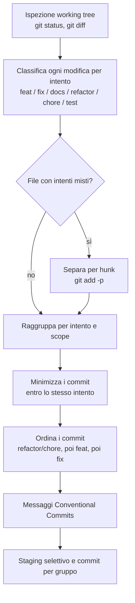

# Commit assistito dall'IA

Skill che trasforma le modifiche pendenti nel **minor numero di commit possibile**, dove ogni commit è un'unità logica coerente e rispetta i [Conventional Commits](../../tecnologie/git/index.md#formato-dei-messaggi).

Il formato dei commit non è una formalità: alimenta il [rilascio assistito dall'IA](rilascio-ia.md) e quindi il [Semantic Versioning](../../regole/versionamento.md). Un commit `feat` implica un `MINOR`, un `fix` un `PATCH`, un `BREAKING CHANGE` un `MAJOR`. Mescolare intenti diversi in un solo commit rende impossibile attribuire alla modifica il giusto peso semver e sporca la storia.

## Il criterio

Due forze in tensione, con una precedenza chiara:

- **Accorpare** — meno commit, purché ognuno resti una sola unità logica. Tre file che realizzano insieme la stessa funzionalità sono un commit, non tre.
- **Non mescolare** — l'accorpamento non vale mai a costo di unire intenti diversi.

**La purezza dell'intento vince sempre sulla riduzione del numero.** Si accorpa il più possibile *entro* lo stesso intento; non si accorpa mai *attraverso* intenti diversi.

Casi che restano sempre separati:

- un **bug fix** non si mescola a una **feature** (`fix` e `feat` → bump semver diversi);
- una **modifica alla documentazione** non si mescola a una **feature** (`docs` non incide sulla versione, `feat` sì);
- un **refactoring** senza cambi di comportamento resta distinto da ciò che cambia comportamento.

Quando un singolo file contiene modifiche di intenti diversi (una feature *e* un fix nello stesso file), si separa **per hunk** in staging selettivo (`git add -p`), così che ogni commit resti puro.

## Cosa fa, passo per passo



1. **Ispeziona il working tree**: file modificati, aggiunti, rimossi; differenze `staged` e non (`git status`, `git diff`, `git diff --staged`).
2. **Classifica ogni modifica per intento**, non per file: cosa fa davvero quella riga — `feat`, `fix`, `docs`, `refactor`, `chore`, `test`, `perf`, `style`.
3. **Separa gli intenti misti** all'interno dello stesso file, per hunk, dove necessario.
4. **Raggruppa** le modifiche dello stesso intento (ed eventualmente dello stesso scope) nel minor numero di commit coerenti.
5. **Ordina i commit** in modo che la storia resti leggibile e ogni commit sia di per sé consistente: tipicamente prima `chore`/`refactor` preparatori, poi `feat`, poi `fix` indipendenti.
6. **Compone i messaggi** secondo Conventional Commits: `<type>(<scope>): <descrizione breve>`, con corpo ed eventuale `BREAKING CHANGE:` dove serve.
7. **Stage selettivo e commit** di ciascun gruppo.

## Esempio

Working tree con quattro file modificati:

| File | Modifica | Intento |
|------|----------|---------|
| `OrdiniService.cs` | nuovo metodo `Annulla` | `feat(ordini)` |
| `OrdiniService.cs` | corretto calcolo del totale (hunk a parte) | `fix(ordini)` |
| `Totale.cs` | corretto calcolo del totale | `fix(ordini)` |
| `README.md` | documentato l'annullamento | `docs` |

Risultato: **tre** commit, non uno e non quattro.

```
feat(ordini): aggiungi annullamento ordine
fix(ordini): correggi il calcolo del totale
docs: documenta l'annullamento ordine
```

`OrdiniService.cs` compare in due commit: l'hunk della feature nel primo, quello del fix nel secondo. La documentazione resta separata dalla feature, perché non incide sulla versione.

## Parametri

| Parametro | Valori | Default | Significato |
|-----------|--------|---------|-------------|
| modalità | `proponi` · `esegui` | `proponi` | `proponi` mostra il raggruppamento previsto senza committare; `esegui` crea i commit |
| ambito | `tutto` · `staged` | `tutto` | Considera tutte le modifiche pendenti o solo quelle già in stage |

## Vincoli

- **Un commit, un intento.** Mai mescolare tipi con peso semver diverso, in particolare `feat` e `fix`, o `feat` e `docs`.
- **Un commit, un'unità logica** — coerente e completa, non un salvataggio intermedio ([git](../../tecnologie/git/index.md#commit)).
- **Conventional Commits sempre**, perché la storia alimenta il changelog e il versioning.
- **Minimizzare, non comprimere**: il numero di commit scende solo finché ogni commit resta puro.
- **Nessun commit lasciato a metà**: ogni gruppo è messo in stage ed effettivamente committato, oppure la skill si ferma e segnala cosa non ha saputo classificare.
