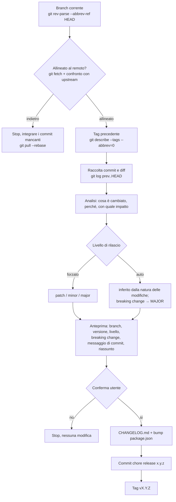

# Rilascio assistito dall'IA

Skill che esegue un rilascio completo (bump di versione, changelog, commit e tag) **alla pari di `commit-and-tag-version`** (lo strumento dietro `pnpm release`), con una differenza sostanziale: il changelog non è prodotto parsando meccanicamente i prefissi dei commit, ma **analizzando i commit e i loro diff rispetto alla versione precedente**.

Lo strumento tradizionale raggruppa i commit per tipo (`feat`, `fix`, …) e ne riporta la riga di descrizione così com'è. L'IA legge invece *cosa è cambiato davvero*: ne ricava un changelog scritto in prosa curata, raggruppato per significato, e può correggere il livello di rilascio quando il prefisso del commit non riflette l'impatto reale (un `fix` che rompe un contratto è un *breaking change*, quindi un `MAJOR`).

Gli artefatti finali sono identici a quelli di un rilascio convenzionale, quindi tutti i [vincoli sul versionamento](../../regole/versionamento.md) restano garantiti: versione in `package.json`, `CHANGELOG.md` aggiornato, commit `chore(release): x.y.z`, tag `vX.Y.Z`.

## Cosa fa, passo per passo



1. **Controlla il branch corrente** (`git rev-parse --abbrev-ref HEAD`) e lo riporta nell'anteprima: un rilascio sul branch sbagliato è il primo errore da intercettare.
2. **Verifica di essere allineato al remoto** (vedi sotto). Se il branch locale è indietro rispetto all'upstream (qualcuno ha pushato commit prima di noi) la skill **si rifiuta di procedere**: una versione staccata su una base non aggiornata perde di senso.
4. **Determina la versione precedente** dal tag più recente (`git describe --tags --abbrev=0`). Se non esiste alcun tag, è il primo rilascio.
5. **Raccoglie le modifiche** dall'intervallo `tag-precedente..HEAD`: messaggi di commit e, dove il messaggio non basta, i diff (`git log`, `git diff`).
6. **Analizza** le modifiche per intento e impatto, non per prefisso: cosa è stato aggiunto, cosa è stato corretto, cosa rompe la compatibilità. Individua esplicitamente i **breaking change**.
7. **Decide il livello semver** (`PATCH` / `MINOR` / `MAJOR` secondo [Semantic Versioning](../../regole/versionamento.md)) oppure usa il livello forzato dall'utente. Un breaking change impone sempre un `MAJOR`. Vale il principio del *no pride versioning*: il bump riflette l'entità reale del cambiamento, mai l'orgoglio del rilascio.
8. **Mostra l'anteprima e attende conferma** (vedi sotto). Fino alla conferma non scrive né committa nulla.
9. Solo **dopo la conferma**: scrive la sezione del changelog in cima a `CHANGELOG.md`, aggiorna `package.json` (unica fonte di verità, mostrata nel footer), crea il commit `chore(release): x.y.z` e il tag `vX.Y.Z`, così che ogni rilascio sia tracciabile a un commit esatto.

Il `push` (`git push && git push --tags`) resta un atto esplicito dell'utente, non incluso nella skill.

## Allineamento al remoto

Una versione ha senso solo se è staccata sulla punta aggiornata del branch. Prima di qualsiasi analisi la skill verifica di non essere indietro rispetto all'upstream:

- aggiorna i riferimenti remoti senza toccare il working tree (`git fetch`);
- confronta `HEAD` con il branch di tracciamento (`git rev-parse @` vs `@{u}`, oppure `git status -sb` / `git rev-list --left-right --count @...@{u}`).

Se risultano commit a monte non ancora integrati (qualcuno ha pushato prima di noi) la skill **si rifiuta di procedere** e **suggerisce di integrare i commit mancanti** (`git pull --rebase`) prima di rilasciare. Non stacca mai una versione su una base superata: il numero perderebbe di significato e il tag punterebbe a uno stato che non riflette il branch reale.

Se il branch non ha un upstream configurato, lo segnala e chiede come procedere anziché assumere di essere allineato.

## Anteprima e conferma

Prima di toccare il repository, la skill mostra un'**anteprima**, non l'intero changelog, ma quanto basta per decidere:

- il **branch** su cui sta per rilasciare;
- la transizione di versione: `attuale → nuova`;
- il **livello** scelto (`PATCH` / `MINOR` / `MAJOR`) e *perché*;
- se sta per generare un **breaking change**, segnalato in modo evidente perché implica una **major version**;
- il **messaggio di commit** esatto che userà;
- un **riassunto molto breve** del changelog (i punti principali, non le voci per esteso).

Poi **attende sempre la conferma**. Senza conferma esplicita non crea il commit né il tag e lascia il working tree intatto.

## Messaggio di commit

Segue la convenzione di `commit-and-tag-version`:

- **prima riga**: solo tipo, scope e numero di versione, **senza contenuto descrittivo**, `chore(release): x.y.z`;
- **corpo**: un **riassunto molto breve** del changelog (poche righe o punti), non il changelog per intero. Il dettaglio completo vive in `CHANGELOG.md`.

```
chore(release): 1.4.0

- aggiunta sezione IA con skill commit e release
- corretto il calcolo del totale ordini
```

## Parametri

| Parametro | Valori | Default | Significato |
|-----------|--------|---------|-------------|
| livello | `auto` · `patch` · `minor` · `major` | `auto` | Forza il bump o lo lascia inferire dall'analisi |
| intervallo | `<ref>..<ref>` | `<ultimo-tag>..HEAD` | Finestra di commit da analizzare |

## Vincoli

- **Conferma obbligatoria.** La skill mostra sempre l'anteprima e attende conferma esplicita prima di creare commit e tag; senza conferma non modifica nulla.
- **Branch controllato.** Il branch corrente è verificato e riportato in anteprima prima del rilascio.
- **Allineato al remoto, o stop.** Se il branch locale è indietro rispetto all'upstream, la skill rifiuta di procedere e suggerisce di integrare i commit mancanti (`git pull --rebase`). Non si rilascia su una base superata.
- **Breaking change → major.** Se l'analisi individua un breaking change, il livello è `MAJOR` e va segnalato in evidenza nell'anteprima.
- **Prima riga del commit senza contenuto**: `chore(release): x.y.z`, solo la versione; il riassunto sta nel corpo, il dettaglio in `CHANGELOG.md`.
- **Ogni rilascio è tracciabile a un tag.** Nessun bump di `package.json` senza il corrispondente tag `vX.Y.Z`.
- **Semantic Versioning, sempre.** Il livello è giustificato dalla natura delle modifiche; in `auto` la skill dichiara *perché* ha scelto quel livello.
- **Registro impersonale** nelle voci di changelog, come nel resto della documentazione.
- **La versione resta visibile**: `package.json` è l'unica fonte di verità, letta a runtime dal footer del sito: la skill non la duplica altrove.

## Rapporto con `commit-and-tag-version`

Non è un sostituto degli artefatti, ma del *modo* in cui si produce il changelog: analisi semantica al posto del parsing dei prefissi. Restano due strade compatibili per l'implementazione, da fissare quando la skill verrà resa eseguibile:

- appoggiarsi a `commit-and-tag-version` per bump e tag, e **sovrascrivere solo la sezione di changelog** con quella generata dall'IA;
- svolgere l'intero flusso autonomamente, replicandone gli artefatti.

In entrambi i casi il risultato per chi legge la storia del repository è lo stesso di un rilascio convenzionale, con un changelog più leggibile.
