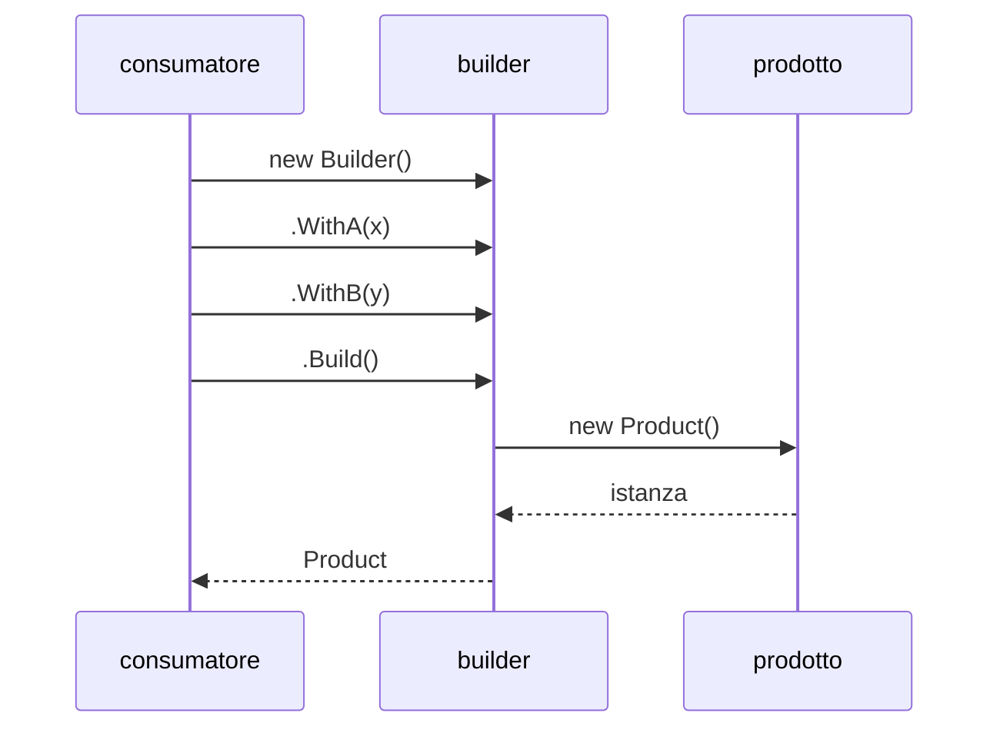

# Builder

## Problema

Un oggetto richiede molti parametri per essere costruito correttamente. Alcuni sono obbligatori, altri opzionali, altri ancora interdipendenti. Le soluzioni ingenue producono difetti noti:

- **Costruttore lungo**: una decina di parametri positional, difficili da leggere e da invocare senza errori.
- **Costruttori telescopici**: una serie di overload, ognuno con un sottoinsieme di parametri. Esplosione combinatoria.
- **Setter pubblici dopo `new`**: l'oggetto è temporaneamente in uno stato invalido. Chi lo legge non sa se è pronto.

## Idea centrale

La costruzione si svolge in più passi, su un oggetto intermedio (*builder*) che accumula la configurazione. Solo alla fine, con una chiamata esplicita (`Build()`, `Create()`), il builder produce l'istanza definitiva — già completa, validata, immutabile.

## I tre attori

### 1. Il prodotto

L'oggetto finale che si vuole costruire. Una volta restituito dal builder è pronto all'uso e — quando possibile — immutabile.

### 2. Il builder

Espone metodi per impostare le proprietà del prodotto, uno alla volta o a gruppi logici. Ciascun metodo restituisce il builder stesso (`return this`) per permettere il *method chaining*, oppure modifica lo stato interno. Espone infine un metodo `Build()` che valida la configurazione e restituisce il prodotto.

### 3. Il consumatore

Crea il builder, lo configura passo passo, chiama `Build()`. Riceve un'istanza pronta o un errore esplicito se la configurazione è incoerente.

## Quando usarlo

- L'oggetto ha molte proprietà di cui solo alcune obbligatorie.
- La costruzione comporta validazioni cross-field che devono avvenire una volta sola, al momento giusto.
- Si vuole un'API di costruzione leggibile, in stile fluente: `Order.Builder().ForCustomer(id).AddItem(...).Build()`.
- Si vuole separare nettamente la fase di configurazione da quella di utilizzo, evitando stati transitori invalidi.

## Quando evitarlo

- L'oggetto ha pochi parametri (due o tre) e il costruttore è già leggibile.
- Il linguaggio offre alternative idiomatiche più leggere: parametri nominati, `record` con `with`, *object initializer*. In questi casi un builder dedicato è solo cerimonia.
- L'oggetto non ha invarianti da proteggere e i setter pubblici sono accettabili.

## Varianti comuni

| Variante | Descrizione |
|----------|-------------|
| Fluent builder | Ogni metodo restituisce `this`, permettendo il chaining |
| Step builder | Il tipo restituito da ogni step cambia, forzando l'ordine di chiamata a compile-time |
| Director | Un oggetto separato orchestra la sequenza di chiamate al builder per produrre varianti predefinite del prodotto |
| Test data builder | Builder dedicato ai test, con default sensati per ogni campo, da sovrascrivere solo dove serve |

## Builder e immutabilità

Il builder è il complemento naturale degli oggetti immutabili: permette di costruirli in più passi senza dover esporre setter pubblici. Una volta che `Build()` ha restituito il prodotto, le modifiche successive richiedono un nuovo builder (o un meccanismo come `with` per record).

## Implementazioni specifiche

- [C# — Builder fluente, step builder e test data builder](../tecnologie/csharp/pattern/builder.md)
