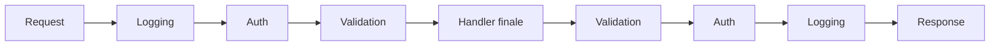

# Chain of Responsibility

## Problema

Una richiesta va elaborata da più passi indipendenti — validazione, autenticazione, autorizzazione, logging, gestione errori, esecuzione vera e propria — ognuno con la sua responsabilità. Annidare tutta la logica in un unico metodo produce codice fragile: ogni nuovo passo si paga modificando un punto centrale, l'ordine si nasconde nella struttura sintattica, ed è difficile riusare i singoli passi in contesti diversi.

## Idea centrale

Ciascun passo diventa un **handler** indipendente. Gli handler sono concatenati in una sequenza: ognuno riceve la richiesta, decide se elaborarla, la passa al successivo. Aggiungere o riordinare passi è una modifica strutturale (alla catena), non una modifica al codice degli handler.

## I tre attori

### 1. Il contesto (la richiesta che attraversa)

L'oggetto che viaggia attraverso la catena. Contiene la richiesta in ingresso e — spesso — uno spazio per accumulare informazioni o per esporre la risposta in uscita.

### 2. Gli handler

Ciascuno è una unità autonoma con una responsabilità sola. Riceve il contesto e ha tre opzioni:

- **Termina** la catena (es. richiesta non autorizzata: risposta `401` e stop).
- **Gestisce** la richiesta e termina (es. eccezione catturata e tradotta in risposta).
- **Delega** al successivo, eventualmente arricchendo il contesto o intervenendo al ritorno.

### 3. La catena

Espone agli handler il modo per invocare il successivo (`next()`). Spesso è gestita da un framework (middleware HTTP, MVC filter, pipeline di MediatR) o costruita esplicitamente.

## Quando usarlo

- L'elaborazione si divide naturalmente in passi indipendenti.
- L'ordine dei passi conta e deve essere esplicito.
- Alcuni passi devono poter interrompere la catena (es. fallimento autorizzazione).
- Si vuole intervenire **al ritorno** (raccogliere metriche, tradurre eccezioni in response, decorare l'output).
- Configurazioni diverse della pipeline servono in contesti diversi (catena ridotta per test, catena estesa in produzione).

## Quando evitarlo

- I passi sono pochi e fissi: una sequenza esplicita di chiamate è più leggibile.
- Gli handler condividono troppo stato: la catena diventa un modo subdolo di accoppiarli.
- L'ordine non conta: gli handler sono in realtà operazioni parallele indipendenti, e ci sono pattern più adatti.

## Chain of Responsibility vs Decorator

I due pattern sono strutturalmente molto simili: entrambi avvolgono un'operazione in una catena. La differenza è di intento:

- **Chain of Responsibility** modella un flusso lungo cui la richiesta passa da uno step all'altro; un handler può legittimamente terminare la catena.
- **Decorator** modella l'aggiunta di comportamento attorno a un'operazione: il decorator delega quasi sempre, e non termina la catena di propria iniziativa.

In pratica i framework moderni li unificano sotto il termine *middleware* / *pipeline*.

## Implementazioni specifiche

- [C# — Middleware ASP.NET Core, MVC filter, MediatR pipeline behavior](../tecnologie/csharp/pattern/chain-of-responsibility.md)
