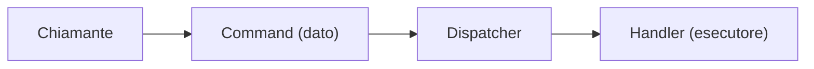

# Command

## Problema

Un'azione va invocata: spesso con parametri, talvolta in modo differito, talvolta tracciata, talvolta annullata, talvolta ripetuta. Invocare il metodo direttamente lega il chiamante al destinatario e impedisce qualunque trattamento dell'azione stessa come oggetto di prima classe: non si può mettere in coda un'invocazione, non si può loggarne il payload completo, non si può rieseguirla in un secondo momento.

## Idea centrale

L'azione diventa un **oggetto**: un dato che descrive *cosa* fare, separato dal codice che lo *esegue*. Si può quindi creare, passare, mettere in coda, serializzare, ispezionare, registrare e — quando il dominio lo permette — annullare.

## I tre attori

### 1. Il command (l'azione come dato)

Un oggetto immutabile che descrive l'azione: il tipo dell'operazione e i parametri necessari per eseguirla. Non contiene logica di esecuzione; è una descrizione.

### 2. L'handler (chi esegue)

Riceve un command e produce un risultato. Conosce il dominio, le dipendenze, gli effetti collaterali. È l'unico a sapere *come* trasformare la descrizione in lavoro reale.

### 3. Il dispatcher (chi smista)

Riceve un command e individua l'handler giusto. Spesso è uno strato sottile sopra il container DI o sopra una libreria di mediator. Centralizza l'invocazione e permette di applicare comportamenti trasversali (logging, validazione, transazione) tramite [decorator](decorator.md) o [pipeline](chain-of-responsibility.md).

## Quando usarlo

- L'azione è un'**operazione di dominio** completa, con un nome, dei parametri, un esito (caso d'uso, *use case*).
- Si vuole un punto unico di ingresso per logging, audit, validazione, gestione errori — applicato a tutte le azioni.
- L'esecuzione va differita: il command finisce in una coda e viene processato in modo asincrono o in background.
- Servono undo, retry o rieseguibilità: il command, essendo un dato, è naturalmente serializzabile e replicabile.
- Si vuole rendere esplicito il vocabolario del dominio: `RegisterCustomer`, `ShipOrder`, `RefundPayment` sono più parlanti di una chiamata di metodo.

## Quando evitarlo

- L'azione è una query semplice: un command introduce indirezione per nulla.
- L'invocazione è interna a un singolo componente: non c'è separazione da realizzare.
- L'overhead della reificazione (classe del command, handler, registrazione) supera il valore: per metodi senza dipendenze cross-cutting, una chiamata diretta è più chiara.

## Varianti e idee correlate

| Variante / pattern correlato | Note |
|---|---|
| **Command bus / Mediator** | Implementazione standard del dispatcher: il chiamante non conosce l'handler |
| **CQRS** | Separa command (scrivono) da query (leggono): il pattern Command è la base lato scrittura |
| **Event sourcing** | Lo stato del sistema è ricostruito riapplicando i command registrati come eventi |
| **Undo** | Il command memorizza informazioni sufficienti a invertire l'effetto |
| **Code di lavoro** | I command vengono serializzati e consumati in modo asincrono |

## Command e caso d'uso

Nella documentazione il termine [caso d'uso](../glossario.md#caso-duso) coincide concettualmente con un command: una classe che incapsula un'operazione di dominio, riceve i suoi parametri, orchestra i servizi necessari e restituisce un esito. Il pattern Command è la generalizzazione di questa idea.

## Implementazioni specifiche

- [C# — Command e MediatR, IUseCase e pipeline behavior](../tecnologie/csharp/pattern/command.md)
