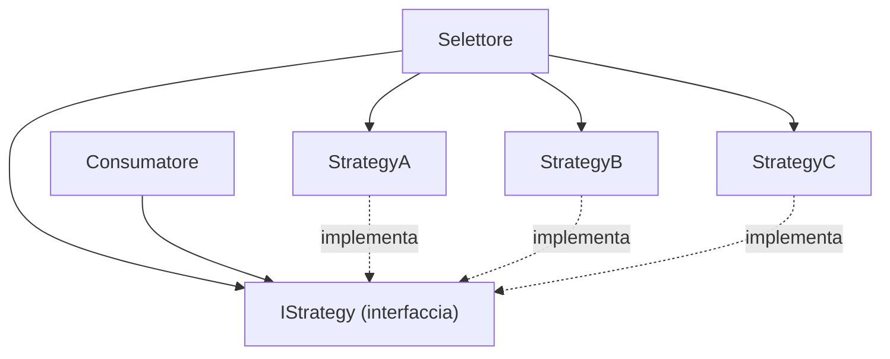

# Strategy

## Problema

Un componente deve eseguire un'operazione che ammette più algoritmi o varianti (regole di calcolo, canali di comunicazione, formati di export). L'approccio ingenuo — una catena di `if`/`switch` — produce codice fragile: ogni nuova variante richiede una modifica al componente esistente, violando il principio Open/Closed.

## Idea centrale

A parità di firma — stesso input, stesso output — esistono più implementazioni possibili dello stesso problema. Lo Strategy pattern separa **chi sceglie** l'implementazione da **chi la usa**.

## I tre attori

### 1. L'interfaccia (il contratto)

Definisce la firma dell'operazione: quali dati entrano e cosa esce. Non dice *come* si risolve il problema — solo *quale forma* ha la soluzione. Tutte le implementazioni rispettano questo contratto.

### 2. Le implementazioni (le strategy concrete)

Ciascuna risolve lo stesso problema in modo diverso: algoritmo differente, canale differente, logica differente. L'importante è che tutte accettino lo stesso input e producano lo stesso tipo di output.

### 3. Il selettore (chi sceglie)

Un attore esterno decide quale implementazione usare. La scelta può basarsi su qualsiasi criterio: una stringa di configurazione, un valore in un header HTTP, un enum, una regola di business. Il selettore conosce le implementazioni disponibili e ne restituisce una al consumatore.

### 4. Il consumatore (chi usa — il *context*)

Il codice che ha bisogno dell'operazione **dipende esclusivamente dall'interfaccia**. Non sa quale implementazione concreta riceve, non gli interessa, e non cambia comportamento in funzione di essa. La logica a valle della selezione resta identica indipendentemente dalla strategy scelta — a meno che l'implementazione non esponga esplicitamente differenze nel risultato (es. un campo opzionale nel DTO di output).

Questo è il vantaggio fondamentale: il consumatore è **disaccoppiato** dalle implementazioni. Aggiungere, rimuovere o sostituire una strategy non tocca il codice che la utilizza.

## Quando usarlo

- Si hanno più varianti di uno stesso comportamento e la scelta dipende da un fattore esterno (configurazione, input, contesto di esecuzione).
- Si vuole rispettare il principio Open/Closed: aggiungere una variante significa aggiungere una classe, non toccare il codice esistente.
- Si vuole rendere le singole varianti testabili in isolamento.
- Si vuole che il consumatore resti ignaro delle implementazioni concrete e lavori solo contro l'interfaccia.

## Quando evitarlo

- Esiste una sola variante e non si prevede che ne servano altre — l'astrazione sarebbe prematura.
- La logica condizionale è banale (due o tre righe) e non merita il costo di un'interfaccia aggiuntiva.

## Varianti comuni

| Variante | Descrizione |
|----------|-------------|
| Selezione a compile-time | La strategy è fissa e iniettata dal container DI |
| Selezione a runtime | La strategy viene scelta dinamicamente in base a un discriminante (enum, stringa, header HTTP) |
| Composizione | Più strategy vengono eseguite in sequenza (chain of responsibility ibrida) |

## Implementazioni specifiche

- [C# — Strategy con `IEnumerable<T>` e Keyed Services](../tecnologie/csharp/pattern/strategy.md)
