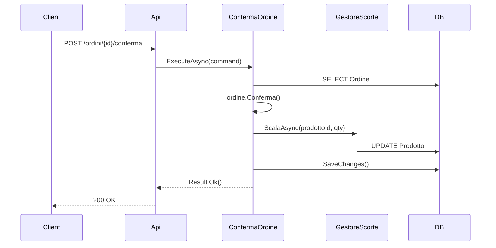

# Step 5 — Flussi Critici

I flussi traducono i casi d'uso in sequenze concrete: chi chiama chi, in quale ordine, con quali dati, cosa succede quando qualcosa va storto. Rendono visibile la complessità nascosta prima che diventi un problema in produzione.

## Quanti flussi dettagliare

Non si dettagliano tutti i flussi — si selezionano i 3-5 più critici: quelli più frequenti, quelli con più dipendenze, quelli dove un errore ha le conseguenze più gravi.

I flussi banali non richiedono diagrammi. Un flusso merita attenzione quando:
- coinvolge più moduli o servizi esterni
- include una transazione database su più tabelle
- ha effetti collaterali difficili da annullare
- gestisce casi d'errore non ovvi

## Cosa includere in ogni flusso

**Percorso felice** — la sequenza nominale dall'input all'output atteso, passo per passo.

**Transazioni** — dove inizia e finisce ogni transazione database. Cosa succede se `SaveChanges()` fallisce a metà del flusso.

**Chiamate esterne** — se il flusso dipende da servizi esterni, cosa succede se non rispondono. Si gestisce con retry, fallback o si propaga l'errore?

**Gestione degli errori** — ogni punto di fallimento possibile e la risposta del sistema. Si usa il Result pattern per propagare gli errori in modo esplicito. Vedi [`regole/gestione-errori`](../../regole/gestione-errori.md).

**Compensazioni** — se un'operazione parzialmente completata deve essere annullata, come avviene? Chi ne è responsabile?

## Formato

I flussi si esprimono come diagrammi di sequenza Mermaid — sono leggibili, versionabili e modificabili dall'IA:

## Criterio di completamento

I flussi critici includono il percorso felice e i fallimenti principali. Un developer può implementarli senza dover inferire la gestione degli errori.

---

**Prossimo step:** [Step 6 — Requisiti Non Funzionali](06-nfr.md)
