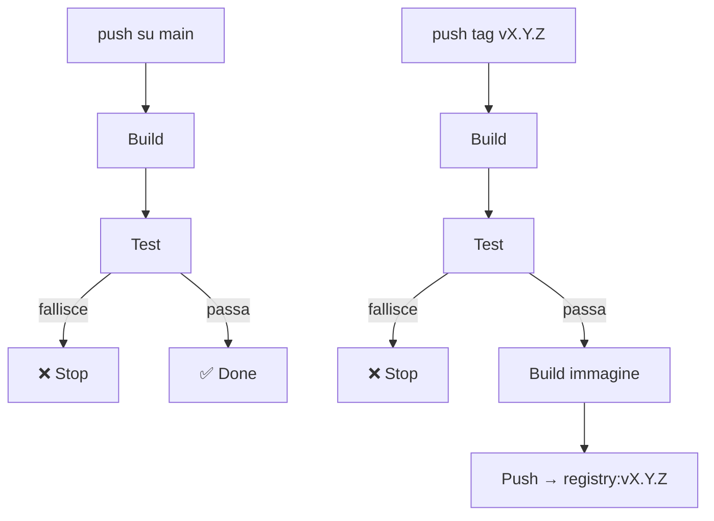

# Pipeline CI/CD

## Responsabilità della pipeline

La pipeline ha un confine preciso: arriva fino alla pubblicazione delle immagini. Tutto ciò che viene dopo — orchestrazione, deploy, promozione tra ambienti — è responsabilità dell'infrastruttura e non riguarda chi scrive codice.

## Step minimi

Ogni push su `main` esegue:

1. **Build** — il codice deve compilare senza errori
2. **Test** — tutti i test devono passare; se fallisce un test, la pipeline si ferma

Ad ogni push che corrisponde a un tag `vX.Y.Z`:

3. **Build dell'immagine container**
4. **Push dell'immagine** nel registry, taggata con la versione

## Immagini e versioni

L'immagine pubblicata porta il tag della versione (`v1.2.3`), non `latest`. Ogni immagine in produzione deve essere tracciabile a un commit preciso — lo stesso principio del tag git descritto in [`regole/versionamento`](../regole/versionamento.md).

## La pipeline è il guardiano

Se la pipeline è rossa, non si pubblica nulla. Non esistono eccezioni, non si bypassa per urgenza. Un'urgenza che richiede di saltare i test è un problema di processo, non un motivo per abbassare le garanzie.