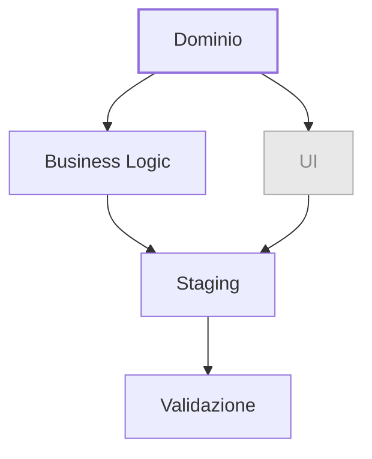

# Sviluppo

Lo sviluppo inizia dove finisce l'analisi tecnica. A questo punto il dominio è modellato, i casi d'uso sono chiari, i contratti sono definiti. Il lavoro consiste nell'implementare quanto pianificato — nell'ordine giusto, con le garanzie giuste.

## Il flusso

Dominio e business logic hanno un ordine preciso e una dipendenza: non si scrive business logic prima che il dominio sia stabile. Una volta stabile il dominio, business logic e UI possono procedere in parallelo — ma la UI è trattata separatamente.

## FAQ

**Quando si considera "fatto" un caso d'uso?**

Quando è arrivato in staging ed è stato approvato da chi ha prodotto l'analisi funzionale attraverso il test end-to-end. Verde in CI non basta — serve la validazione sul comportamento reale.

**Quando si porta qualcosa in staging?**

Essendo trunk-based development, si può portare in staging in qualsiasi momento in cui c'è qualcosa di completo. Non si aspetta la fine dello sprint: appena un caso d'uso è sviluppato, testato e integrato su `main`, può essere rilasciato.

**Si scrive prima il test o prima il codice?**

Non è fondamentale scrivere il test prima del codice. È fondamentale scrivere codice testabile — progettare come se il test dovesse essere scritto, anche se poi viene scritto dopo. La disciplina del TDD si applica nel ragionamento, non necessariamente nell'ordine delle righe.

**Si trovano bug su codice non correlato al task corrente — cosa si fa?**

Si segnala sempre. Poi si decide insieme: è bloccante? è bypassabile? quanto influisce sulle stime? quanto influisce sul task corrente? La scoperta va tracciata — non si ignora e non si corregge in silenzio senza comunicarlo.

---

**Inizia da:** [Step 1 — Dominio](01-dominio.md)
