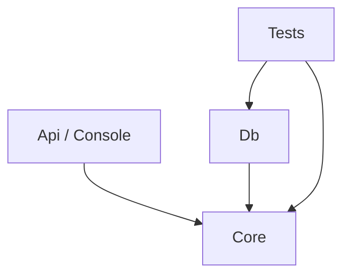

# Architettura

## Struttura della solution

Non esiste un'architettura unica imposta, ma esistono basi minime che ogni soluzione deve rispettare.

La struttura minima è composta da tre progetti:

```
NomeSoluzione.Core/      # business logic
NomeSoluzione.Db/        # Entity Framework, DbContext, migration
NomeSoluzione.Tests/     # test di integrazione
```

A questi si aggiungono i progetti di alto livello in base alle necessità:

```
NomeSoluzione.Api/       # WebAPI ASP.NET Core
NomeSoluzione.Console/   # applicazione console, worker, job
```

## Regole di dipendenza

Le dipendenze hanno una direzione precisa e non si invertono:



- **Core** non dipende da nessun altro progetto della solution. Contiene tutta la business logic e non sa nulla di database, HTTP o interfacce utente.
- **Db** dipende da Core — conosce le entity e implementa ciò che Core definisce.
- **Api e Console** dipendono da Core — orchestrano i casi d'uso, non li implementano.
- **Tests** dipende da Core e da Db — verifica il comportamento reale, database incluso.

Se un progetto di alto livello contiene business logic, quella logica è nel posto sbagliato.

## Core

Il progetto Core è il centro della solution. Contiene:

- le **entity del dominio** — modellate secondo le regole in [`regole/dominio`](dominio.md)
- la **business logic** — casi d'uso, regole, validazioni
- le **interfacce** verso l'esterno (repository, servizi) — implementate negli altri progetti

Core non ha dipendenze su framework di infrastruttura. Non referenzia EF, non conosce SQL, non sa come vengono serializzate le risposte HTTP.

## Db

Il progetto Db contiene tutto ciò che riguarda la persistenza:

- il **DbContext** e le configurazioni Fluent API
- le **migration**
- le implementazioni concrete dei repository definiti in Core

Segue le regole descritte in [`regole/entity-framework`](entity-framework.md).

## Screaming Architecture

La struttura del codice deve comunicare immediatamente cosa fa il sistema, non come è costruito tecnicamente.

Aprire un progetto e vedere cartelle come `Controllers/`, `Services/`, `Repositories/` non comunica nulla sul dominio specifico dell'applicazione. Aprire un progetto e vedere `Ordini/`, `Fatturazione/`, `Clienti/` dice tutto.

Il nome di ogni modulo, cartella, classe e metodo deve rispondere alla domanda: **cosa fa?** Non "che tipo di oggetto è" — cosa fa nel contesto di questo sistema.

```
// Sbagliato: organizzato per tipo tecnico
Core/
  Services/
    OrdineService.cs
    ClienteService.cs

// Corretto: organizzato per dominio
Core/
  Ordini/
    CreaOrdine.cs
    AnnullaOrdine.cs
  Clienti/
    RegistraCliente.cs
```

Questo vale a tutti i livelli: struttura dei progetti, cartelle, classi, metodi, endpoint API. Se il nome richiede un commento per essere capito, il nome è sbagliato.

## Progetti di alto livello

Api, Console e simili hanno un unico compito: **orchestrare**. Ricevono input dall'esterno, invocano il Core, restituiscono output. Non contengono business logic.

Un progetto di alto livello che cresce troppo è un segnale che della logica è finita nel posto sbagliato.