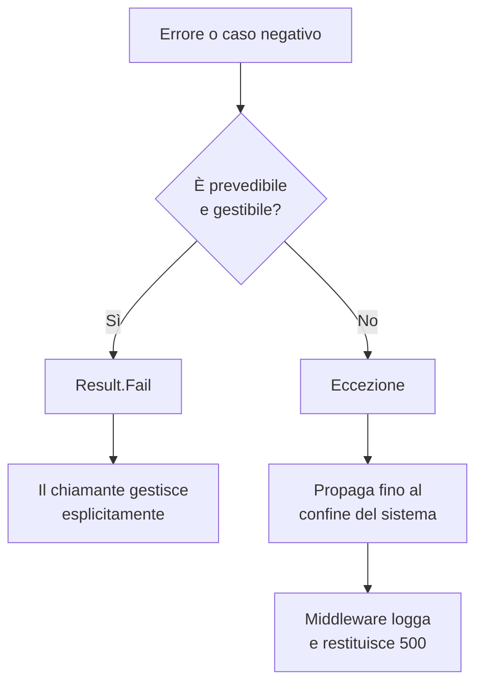

# Gestione degli Errori

## Eccezioni vs Result

Le eccezioni, come dice il nome, sono per situazioni eccezionali: eventi imprevedibili, fuori dal controllo del sistema, ai quali si possono prendere solo contromisure limitate e generiche. Un timeout di rete, un disco pieno, una dipendenza esterna irraggiungibile.

Per tutto ciò che è prevedibile e gestibile — validazioni, regole di business non soddisfatte, stati non validi, risorse non trovate — si usa il **[Result pattern](../../glossario#result-pattern)**.



## Result pattern

Un Result incapsula l'esito di un'operazione senza lanciare eccezioni. Chi chiama sa sempre che l'operazione può fallire e deve gestire esplicitamente entrambi i casi.

```csharp
// Esempio di struttura base
public class Result<T>
{
    public bool IsSuccess { get; }
    public T? Value { get; }
    public string? Error { get; }

    private Result(T value) { IsSuccess = true; Value = value; }
    private Result(string error) { IsSuccess = false; Error = error; }

    public static Result<T> Ok(T value) => new(value);
    public static Result<T> Fail(string error) => new(error);
}
```

L'errore non è uno stato nascosto: è parte esplicita del contratto.

## Regole

**Le eccezioni non si usano per il controllo del flusso.** Usare `try/catch` per gestire un caso previsto — come un utente non trovato o un importo non valido — è un abuso delle eccezioni. Quel caso va modellato come `Result.Fail(...)`.

**Le eccezioni si lasciano propagare.** Quando si verifica davvero un'eccezione, non si cattura per nasconderla o trasformarla in un Result generico. Si lascia propagare fino al confine del sistema (es. middleware ASP.NET Core), dove viene loggata e restituita come errore 500.

**Il Core non lancia eccezioni di business.** Tutta la logica di business nel progetto Core comunica tramite Result. Le eccezioni che emergono dal Core sono per definizione impreviste.

**I Result si compongono.** Operazioni che dipendono l'una dall'altra si concatenano controllando il risultato a ogni step, senza annidare try/catch.

```csharp
// Flusso esplicito, senza eccezioni
var clienteResult = await _clienteRepository.GetByIdAsync(id);
if (!clienteResult.IsSuccess)
    return Result<Ordine>.Fail(clienteResult.Error!);

var ordineResult = _ordineDomainService.Crea(clienteResult.Value!, righe);
if (!ordineResult.IsSuccess)
    return Result<Ordine>.Fail(ordineResult.Error!);

return ordineResult;
```

## Quando usare le eccezioni

- Errori infrastrutturali imprevedibili: mancata connessione al database, query in timeout, rete non raggiungibile
- Violazioni di precondizioni interne — bug nel codice, non stati di errore attesi
- Situazioni in cui non esiste una recovery significativa

Il principio è che ci si aspetta che l'infrastruttura funzioni. Non si scrive codice difensivo contro la rete o il database: se il DB non risponde, il sistema non può operare e l'eccezione deve emergere. Non c'è un `Result.Fail("database non raggiungibile")` — non c'è nulla di utile che il chiamante possa fare con quell'informazione.

Fanno eccezione i casi in cui il codice opera deliberatamente su infrastruttura potenzialmente instabile. Un esempio tipico: l'applicazione di migration al startup, dove è sensato gestire esplicitamente il fallimento e ritentare o loggare in modo strutturato prima di terminare il processo.

Se ti trovi a scrivere `catch (Exception ex)` per gestire un caso d'uso normale, il design va rivisto.