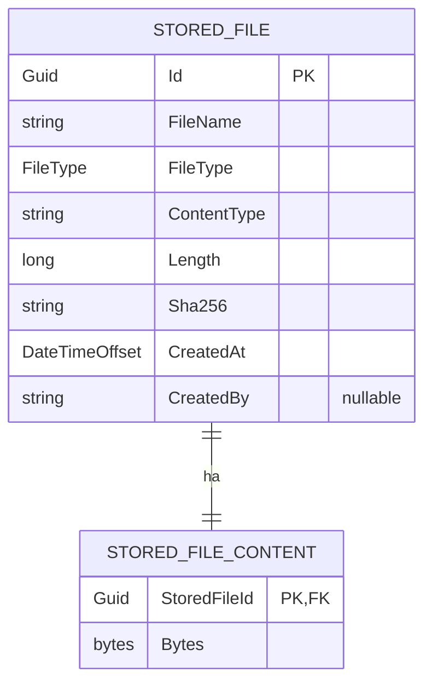

# Filesystem su database (EF)

Quando i file sono piccoli e il requisito principale è avere tutto nel database — backup unico, transazioni, permessi centralizzati, niente dipendenza da filesystem condivisi — si può implementare uno storage su DB con Entity Framework.

L'idea è separare:

- **`StoredFile`**: metadati — nome, tipo di file, content-type, size, hash
- **`StoredFileContent`**: contenuto binario (`byte[]`)



Questa soluzione è adatta a file piccoli. Il limite reale dipende da quanta RAM sei disposto a consumare per request: se leggi tutto il file in memoria prima di salvarlo, il payload, i buffer ASP.NET Core e il `byte[]` EF convivono nello stesso processo.

## Quando usarlo

Buoni candidati:

- allegati piccoli (PDF brevi, immagini ridotte, documenti firmati)
- template importati da pannello admin
- file applicativi che devono stare dentro backup/restore del database

Cattivi candidati:

- video, zip grandi, immagini in massa
- file serviti ad alto throughput
- storage con retention molto lunga o crescita rapida

## Entità

```csharp
// MyApp.Infrastructure/Files/FileType.cs
public enum FileType
{
    Other = 0,
    Pdf = 1,
    Image = 2,
    Document = 3
}
```

```csharp
// MyApp.Infrastructure/Files/StoredFile.cs
public class StoredFile
{
    public Guid Id { get; set; }

    public string FileName { get; set; } = default!;

    // Classificazione del file: l'Id resta la chiave, FileType serve a filtrare
    public FileType FileType { get; set; }
    public string ContentType { get; set; } = default!;

    public long Length { get; set; }
    public string Sha256 { get; set; } = default!;

    public DateTimeOffset CreatedAt { get; set; }
    public string? CreatedBy { get; set; }

    public StoredFileContent Content { get; set; } = default!;
}
```

```csharp
// MyApp.Infrastructure/Files/StoredFileContent.cs
public class StoredFileContent
{
    public Guid StoredFileId { get; set; }
    public byte[] Bytes { get; set; } = default!;

    public StoredFile File { get; set; } = default!;
}
```

Tenere i metadati separati dal blob permette di elencare i file senza trascinarsi dietro il `byte[]` ad ogni query.

## Configurazione EF

```csharp
// MyApp.Infrastructure/Files/StoredFileConfiguration.cs
public class StoredFileConfiguration : IEntityTypeConfiguration<StoredFile>
{
    public void Configure(EntityTypeBuilder<StoredFile> builder)
    {
        builder.ToTable(nameof(StoredFile));
        builder.HasKey(x => x.Id);

        builder.Property(x => x.FileName)
            .HasMaxLength(255)
            .IsRequired();

        // Enum salvato come stringa: la riga resta leggibile direttamente sul DB
        builder.Property(x => x.FileType)
            .HasConversion<string>()
            .HasMaxLength(20)
            .IsRequired();

        builder.Property(x => x.ContentType)
            .HasMaxLength(200)
            .IsRequired();

        builder.Property(x => x.Length)
            .IsRequired();

        builder.Property(x => x.Sha256)
            .HasMaxLength(64)
            .IsRequired();

        builder.Property(x => x.CreatedBy)
            .HasMaxLength(200);

        builder.HasIndex(x => x.FileType);

        builder.HasIndex(x => x.CreatedAt);

        builder.HasOne(x => x.Content)
            .WithOne(x => x.File)
            .HasForeignKey<StoredFileContent>(x => x.StoredFileId)
            .OnDelete(DeleteBehavior.Cascade);
    }
}
```

```csharp
// MyApp.Infrastructure/Files/StoredFileContentConfiguration.cs
public class StoredFileContentConfiguration : IEntityTypeConfiguration<StoredFileContent>
{
    public void Configure(EntityTypeBuilder<StoredFileContent> builder)
    {
        builder.ToTable(nameof(StoredFileContent));
        builder.HasKey(x => x.StoredFileId);

        builder.Property(x => x.Bytes)
            .HasColumnType("varbinary(max)")
            .IsRequired();
    }
}
```

Con PostgreSQL il tipo colonna sarà tipicamente `bytea`; con SQL Server `varbinary(max)`.

## DbContext

```csharp
public class AppDbContext : DbContext
{
    public DbSet<StoredFile> StoredFiles => Set<StoredFile>();
    public DbSet<StoredFileContent> StoredFileContents => Set<StoredFileContent>();
}
```

## Servizio applicativo

Il servizio impone una dimensione massima. Non esiste un numero giusto per tutti: dipende dalla RAM disponibile, dal numero massimo di upload concorrenti e dal fatto che il file venga letto interamente in memoria.

```csharp
// MyApp.Infrastructure/Files/DbFileStorage.cs
using System.Security.Cryptography;

public sealed class DbFileStorage
{
    private const int MaxFileBytes = 512 * 1024; // 512 KB
    private readonly AppDbContext _db;

    public DbFileStorage(AppDbContext db)
        => _db = db;

    // Aggiunge al DbContext ma NON chiama SaveChanges: la unit of work
    // la chiude il comando che orchestra l'operazione.
    public async Task<Guid> SaveAsync(
        string fileName,
        string contentType,
        Stream content,
        string? createdBy,
        CancellationToken ct = default)
    {
        var bytes = await ReadAllBytesAsync(content, MaxFileBytes, ct);
        var fileId = Guid.NewGuid();

        var entity = new StoredFile
        {
            Id          = fileId,
            FileName    = fileName,
            FileType    = ResolveFileType(contentType),
            ContentType = contentType,
            Length      = bytes.Length,
            Sha256      = Convert.ToHexString(SHA256.HashData(bytes)),
            CreatedAt   = DateTimeOffset.UtcNow,
            CreatedBy   = createdBy,
            Content     = new StoredFileContent
            {
                StoredFileId = fileId,
                Bytes        = bytes
            }
        };

        // L'Id è generato qui, quindi è noto prima del commit.
        _db.StoredFiles.Add(entity);
        return fileId;
    }

    public async Task<StoredFileDownload?> GetAsync(Guid id, CancellationToken ct = default)
    {
        return await _db.StoredFiles
            .AsNoTracking()
            .Where(x => x.Id == id)
            .Select(x => new StoredFileDownload(
                x.FileName,
                x.ContentType,
                x.Content.Bytes))
            .SingleOrDefaultAsync(ct);
    }

    public async Task<IReadOnlyList<StoredFileListItem>> ListAsync(
        FileType fileType,
        CancellationToken ct = default)
    {
        return await _db.StoredFiles
            .AsNoTracking()
            .Where(x => x.FileType == fileType)
            .OrderByDescending(x => x.CreatedAt)
            .Select(x => new StoredFileListItem(
                x.Id,
                x.FileName,
                x.FileType,
                x.ContentType,
                x.Length,
                x.CreatedAt))
            .ToListAsync(ct);
    }

    public async Task<bool> DeleteAsync(Guid id, CancellationToken ct = default)
    {
        var entity = await _db.StoredFiles.SingleOrDefaultAsync(x => x.Id == id, ct);
        if (entity is null) return false;

        // Anche qui niente SaveChanges: solo marcatura per la rimozione.
        _db.StoredFiles.Remove(entity);
        return true;
    }

    private static FileType ResolveFileType(string contentType) => contentType switch
    {
        "application/pdf" => FileType.Pdf,
        _ when contentType.StartsWith("image/", StringComparison.OrdinalIgnoreCase)
            => FileType.Image,
        "application/msword"
            or "application/vnd.openxmlformats-officedocument.wordprocessingml.document"
            => FileType.Document,
        _ => FileType.Other
    };

    private static async Task<byte[]> ReadAllBytesAsync(
        Stream stream,
        int maxBytes,
        CancellationToken ct)
    {
        using var ms = new MemoryStream();
        await stream.CopyToAsync(ms, ct);

        if (ms.Length > maxBytes)
            throw new InvalidOperationException($"File troppo grande. Max consentito: {maxBytes} byte.");

        return ms.ToArray();
    }
}

public sealed record StoredFileDownload(
    string FileName,
    string ContentType,
    byte[] Bytes);

public sealed record StoredFileListItem(
    Guid Id,
    string FileName,
    FileType FileType,
    string ContentType,
    long Length,
    DateTimeOffset CreatedAt);
```

Il punto chiave è che `ListAsync` interroga solo `StoredFile`, mentre `GetAsync` va anche sul contenuto. Così l'indexing resta leggero e il blob si materializza solo quando serve davvero.

Il servizio **non chiama `SaveChanges`**: aggiunge o marca entità sul `DbContext` e basta. La chiusura della unit of work è responsabilità del comando che orchestra l'operazione, secondo la convenzione del [livello UseCases](../../struttura-soluzione/04-usecases.md). Così lo stesso `DbFileStorage` può partecipare a una transazione più ampia — ad esempio salvare un allegato e l'entità che lo referenzia in un unico commit.

## Comando

Il comando orchestra il servizio e chiude la transazione, restituendo un `Result`:

```csharp
// usecases — orchestrazione + SaveChanges + Result
public class CaricaFile : IUseCase<CaricaFileDto, Result<Guid>>
{
    private readonly AppDbContext _db;
    private readonly DbFileStorage _storage;

    public CaricaFile(AppDbContext db, DbFileStorage storage)
        => (_db, _storage) = (db, storage);

    public async Task<Result<Guid>> ExecuteAsync(CaricaFileDto cmd, CancellationToken ct)
    {
        var id = await _storage.SaveAsync(
            cmd.FileName, cmd.ContentType, cmd.Content, cmd.CreatedBy, ct);

        await _db.SaveChangesAsync(ct); // qui si chiude la unit of work
        return Result.Success(id);
    }
}

public sealed record CaricaFileDto(
    string FileName,
    string ContentType,
    Stream Content,
    string? CreatedBy);
```

## Registrazione

```csharp
builder.Services.AddScoped<DbFileStorage>();
builder.Services.AddScoped<CaricaFile>();
```

## Esempio API

```csharp
[ApiController]
[Route("api/files")]
public class FilesController : ControllerBase
{
    // La scrittura passa dal comando, che chiude la unit of work.
    [HttpPost]
    [RequestSizeLimit(512 * 1024)]
    public async Task<IActionResult> Upload(
        IFormFile file,
        [FromServices] CaricaFile useCase,
        CancellationToken ct)
    {
        await using var stream = file.OpenReadStream();

        var risultato = await useCase.ExecuteAsync(
            new CaricaFileDto(
                file.FileName,
                file.ContentType,
                stream,
                User.Identity?.Name),
            ct);

        return risultato.IsSuccess
            ? Ok(new { id = risultato.Value })
            : BadRequest(risultato.Errore);
    }

    // La lettura è una query: nessuna unit of work da chiudere, va direttamente al servizio.
    [HttpGet("{id:guid}")]
    public async Task<IActionResult> Download(
        Guid id,
        [FromServices] DbFileStorage storage,
        CancellationToken ct)
    {
        var file = await storage.GetAsync(id, ct);
        return file is null
            ? NotFound()
            : File(file.Bytes, file.ContentType, file.FileName);
    }
}
```

Il `RequestSizeLimit` va allineato al limite applicativo del servizio, altrimenti ASP.NET Core può accettare file più grandi di quelli che poi lo storage rifiuta.

## Migration

```bash
dotnet ef migrations add AddStoredFiles \
    --project src/MyApp.Infrastructure \
    --startup-project src/MyApp.Api
```

## Considerazioni operative

- **RAM**: il limite massimo va deciso in base ai picchi concorrenti. `100` upload simultanei da `512 KB` non sono più "piccoli".
- **Query listing**: non usare `Include(x => x.Content)` nelle liste, altrimenti il database filesystem perde il vantaggio della separazione.
- **Deduplica**: l'hash `SHA-256` permette di rilevare file identici. Se serve, si può introdurre una tabella contenuti condivisi.
- **Backup**: il vantaggio principale è avere dati e file nello stesso backup; lo svantaggio è che il DB cresce più in fretta.
- **Non per streaming**: per file grandi o download intensivi è meglio object storage o filesystem dedicato.
