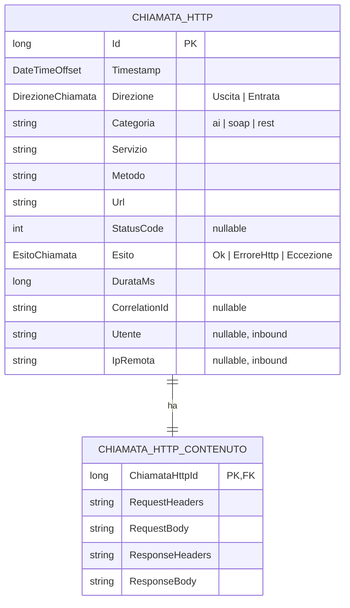

# Log integrale di chiamate HTTP (DelegatingHandler + EF)

Quando l'applicazione chiama servizi esterni — un provider IA, una API REST, un endpoint SOAP — spesso serve registrare **l'intera chiamata**: metodo, URL, headers e body sia di richiesta che di risposta, con esito e durata. È il caso del [log delle chiamate IA tenuto «a parte»](04-db-prompt-ai.md#considerazioni-operative): qui lo si modella in modo **generico**, così la stessa tabella copre la chiamata al modello, la REST di terze parti e — *per assurdo* — anche la busta SOAP, perché a questo livello una chiamata HTTP è sempre la stessa cosa: headers più un body, qualunque sia il content-type.

La struttura è **una sola** per entrambi i versi della comunicazione: un campo `Direzione` distingue le chiamate che l'app *fa* (outbound) da quelle che *riceve* (inbound). L'outbound si cattura con un `DelegatingHandler` su `HttpClient`, l'inbound con un middleware — ma finiscono nella stessa tabella, con gli stessi indici. L'[HTTP audit log](../02-http-audit-log.md) inbound diventa così un produttore di questa struttura unificata, non un modello a parte (vedi [Inbound](#inbound-la-stessa-struttura-con-direzione--entrata)).

## Cosa cattura

- **Metodo, URL, headers e body** di richiesta e risposta, in chiaro e per intero (entro un limite di dimensione).
- **Esito**: risposta HTTP riuscita, errore HTTP, oppure eccezione di trasporto (timeout, DNS, connessione) — casi distinti, perché «nessuna risposta» non è uno status code.
- **Durata** e un **identificativo di correlazione** per legare più chiamate alla stessa operazione applicativa (utile coi retry: ogni tentativo è una riga, tutte con lo stesso `CorrelationId`).

Generico sul content-type: il body JSON di un'API IA e l'envelope XML di un servizio SOAP finiscono nella stessa colonna di testo, senza che il modello sappia nulla del formato.

## Il modello dati

I **metadati** — quello su cui si filtra e si fanno report — stanno separati dal **payload**, che è grosso e non serve quando si scorrono i log. È la stessa logica della separazione [`StoredFile` / `StoredFileContent`](03-db-filesystem.md): elencare le chiamate di un servizio in errore nelle ultime due ore non deve trascinare in memoria buste SOAP da centinaia di KB.



```csharp
// MyApp.Infrastructure/Logging/DirezioneChiamata.cs
public enum DirezioneChiamata
{
    Uscita = 0,   // chiamata che l'app fa verso un servizio esterno
    Entrata = 1   // chiamata che l'app riceve (audit inbound)
}

// MyApp.Infrastructure/Logging/EsitoChiamata.cs
public enum EsitoChiamata
{
    Ok = 0,          // risposta HTTP con status < 400
    ErroreHttp = 1,  // risposta HTTP con status >= 400
    Eccezione = 2    // nessuna risposta: timeout, DNS, connessione rifiutata...
}
```

```csharp
// MyApp.Infrastructure/Logging/ChiamataHttp.cs
public class ChiamataHttp
{
    public long Id { get; set; }
    public DateTimeOffset Timestamp { get; set; }

    public DirezioneChiamata Direzione { get; set; }

    // Etichette logiche per filtrare e aggregare: 'ai', 'soap', 'rest'
    public string Categoria { get; set; } = default!;
    // Nome logico del servizio chiamato: 'anthropic', 'fatturazione-soap'
    public string Servizio { get; set; } = default!;

    public string Metodo { get; set; } = default!;   // GET, POST...
    public string Url { get; set; } = default!;

    public int? StatusCode { get; set; }   // null quando Esito = Eccezione
    public EsitoChiamata Esito { get; set; }
    public string? Errore { get; set; }     // messaggio dell'eccezione, se presente

    public long DurataMs { get; set; }

    // Lega più chiamate alla stessa operazione (es. i tentativi di un retry).
    // Tipicamente l'ID dell'Activity corrente (W3C trace id)
    public string? CorrelationId { get; set; }

    // Contesto del chiamante: valorizzati solo per le chiamate in entrata (inbound)
    public string? Utente { get; set; }
    public string? IpRemota { get; set; }

    public ChiamataHttpContenuto Contenuto { get; set; } = default!;
}
```

```csharp
// MyApp.Infrastructure/Logging/ChiamataHttpContenuto.cs
public class ChiamataHttpContenuto
{
    public long ChiamataHttpId { get; set; }

    public string? RequestHeaders { get; set; }   // JSON header->valore
    public string? RequestBody { get; set; }
    public bool RequestTroncata { get; set; }

    public string? ResponseHeaders { get; set; }
    public string? ResponseBody { get; set; }
    public bool ResponseTroncata { get; set; }

    public ChiamataHttp Chiamata { get; set; } = default!;
}
```

Se nel proprio caso i log si leggono sempre per intero, le due tabelle si possono fondere in una sola: la separazione paga solo se si scorrono i metadati senza i body.

## Configurazione EF

```csharp
// MyApp.Infrastructure/Logging/ChiamataHttpConfiguration.cs
public class ChiamataHttpConfiguration : IEntityTypeConfiguration<ChiamataHttp>
{
    public void Configure(EntityTypeBuilder<ChiamataHttp> builder)
    {
        builder.ToTable(nameof(ChiamataHttp));
        builder.HasKey(x => x.Id);

        // Enum come stringa: la riga resta leggibile direttamente sul DB
        builder.Property(x => x.Direzione).HasConversion<string>().HasMaxLength(10).IsRequired();
        builder.Property(x => x.Esito).HasConversion<string>().HasMaxLength(15).IsRequired();

        builder.Property(x => x.Categoria).HasMaxLength(30).IsRequired();
        builder.Property(x => x.Servizio).HasMaxLength(100).IsRequired();
        builder.Property(x => x.Metodo).HasMaxLength(10).IsRequired();
        builder.Property(x => x.Url).HasMaxLength(2048).IsRequired();
        builder.Property(x => x.CorrelationId).HasMaxLength(64);
        builder.Property(x => x.Utente).HasMaxLength(200);
        builder.Property(x => x.IpRemota).HasMaxLength(45); // lunghezza max IPv6

        // L'ordinamento per data — l'accesso dominante — si imposta a livello
        // di motore: vedi la sezione «Indici». Qui restano gli indici sui filtri.
        builder.HasIndex(x => new { x.Servizio, x.Timestamp });
        builder.HasIndex(x => new { x.Categoria, x.Timestamp });

        // «gli errori recenti»: indice parziale, resta piccolo escludendo gli Ok
        builder.HasIndex(x => x.Timestamp)
            .HasDatabaseName("IX_ChiamataHttp_Errori")
            .HasFilter("[Esito] <> 'Ok'");

        // Solo se si interroga davvero per questi criteri:
        builder.HasIndex(x => x.CorrelationId);                // tentativi di una stessa operazione
        builder.HasIndex(x => new { x.Utente, x.Timestamp });  // audit per utente (inbound)

        builder.HasOne(x => x.Contenuto)
            .WithOne(x => x.Chiamata)
            .HasForeignKey<ChiamataHttpContenuto>(x => x.ChiamataHttpId)
            .OnDelete(DeleteBehavior.Cascade);
    }
}

// MyApp.Infrastructure/Logging/ChiamataHttpContenutoConfiguration.cs
public class ChiamataHttpContenutoConfiguration
    : IEntityTypeConfiguration<ChiamataHttpContenuto>
{
    public void Configure(EntityTypeBuilder<ChiamataHttpContenuto> builder)
    {
        builder.ToTable(nameof(ChiamataHttpContenuto));
        builder.HasKey(x => x.ChiamataHttpId);

        // Testo lungo: nvarchar(max) su SQL Server, text su PostgreSQL
        builder.Property(x => x.RequestHeaders).HasColumnType("nvarchar(max)");
        builder.Property(x => x.RequestBody).HasColumnType("nvarchar(max)");
        builder.Property(x => x.ResponseHeaders).HasColumnType("nvarchar(max)");
        builder.Property(x => x.ResponseBody).HasColumnType("nvarchar(max)");
    }
}
```

```csharp
public class AppDbContext : DbContext
{
    public DbSet<ChiamataHttp> ChiamateHttp => Set<ChiamataHttp>();
    public DbSet<ChiamataHttpContenuto> ChiamateHttpContenuti => Set<ChiamataHttpContenuto>();
}
```

## Indici

`ChiamataHttp` è una tabella **in forte scrittura**: ogni chiamata è un insert e ogni indice in più è lavoro in più ad ogni insert. Vale qui più che altrove la regola di tenere [solo gli indici giustificati da un accesso reale](../../../database-relazionali/best-practice/indici.md) — meglio pochi indici sui pattern veri che una copertura difensiva.

L'accesso dominante è **per intervallo di tempo** («le chiamate delle ultime due ore», «gli errori di stamattina»), e la **data governa anche la retention** (si elimina o si stacca ciò che è più vecchio di N giorni). Quindi la `Timestamp` non è solo l'indice più importante: è il criterio su cui conviene **ordinare fisicamente** la tabella, così una finestra temporale è contigua sul disco e la pulizia colpisce un blocco continuo. Il come cambia col motore:

- **SQL Server** — clustered index su `(Timestamp, Id)` e chiave primaria su `Id` dichiarata `NONCLUSTERED`. Gli insert restano in coda (la data cresce nel tempo, niente page split) e le letture per intervallo sono sequenziali — il caso descritto in [SQL Server](../../../database-relazionali/sqlserver.md).

  ```csharp
  // ordina la tabella per data; la PK su Id resta unica ma non clustered
  builder.HasKey(x => x.Id).IsClustered(false);
  builder.HasIndex(x => new { x.Timestamp, x.Id }).IsClustered();
  ```

- **PostgreSQL** — la tabella è una heap: sulla `Timestamp` un indice **BRIN** è ideale per una tabella append-only ordinata nel tempo (minuscolo, perfetto per i range), tipicamente insieme al **partizionamento per mese**, che rende la retention un `DROP` di partizione. Vedi [PostgreSQL](../../../database-relazionali/postgres.md).

- **SQLite** — l'`INTEGER PRIMARY KEY` (alias del rowid) tiene gli insert in coda; un indice esplicito sulla `Timestamp` copre le letture per data. Vedi [SQLite](../../../database-relazionali/sqlite.md).

Sopra l'ordinamento temporale, gli indici composti servono i filtri ricorrenti, sempre con la `Timestamp` in coda alla chiave perché la domanda è «questo criterio, di recente»:

- `(Servizio, Timestamp)` e `(Categoria, Timestamp)` — «le chiamate di un servizio o di una categoria, ultime X»;
- un indice **parziale** sulla `Timestamp` con filtro `Esito <> 'Ok'` — «gli errori recenti»: resta piccolo perché il grosso del traffico è `Ok`, e non sporca gli insert delle chiamate riuscite;
- `CorrelationId` e `(Utente, Timestamp)` **solo se** si interroga davvero per correlazione o per utente; altrimenti sono peso morto su ogni insert.

`ChiamataHttpContenuto` non ha indici propri oltre alla chiave: vi si accede **solo per `ChiamataHttpId`**, quando si apre una singola chiamata per vederne il corpo. Su SQLite ha senso come tabella `WITHOUT ROWID`, dato che la si legge sempre per quella chiave.

## La cattura: un DelegatingHandler

Per le chiamate in uscita il punto d'aggancio idiomatico è un `DelegatingHandler` inserito nella pipeline di `HttpClient`: intercetta **qualunque** chiamata passi da quel client — l'SDK del provider IA, un client REST tipizzato, un client SOAP basato su `HttpClient` — senza che il codice chiamante ne sappia nulla.

```csharp
// MyApp.Infrastructure/Logging/LogChiamateHandler.cs
using System.Diagnostics;
using System.Text.Json;

public sealed class LogChiamateHandler : DelegatingHandler
{
    private const int MaxBodyBytes = 64 * 1024; // 64 KB: oltre, si tronca

    private static readonly string[] HeaderDaOscurare =
        { "Authorization", "x-api-key", "api-key", "Cookie", "Set-Cookie" };

    private readonly IServiceScopeFactory _scopeFactory;
    private readonly OpzioniLogChiamata _opzioni;

    public LogChiamateHandler(IServiceScopeFactory scopeFactory, OpzioniLogChiamata opzioni)
        => (_scopeFactory, _opzioni) = (scopeFactory, opzioni);

    protected override async Task<HttpResponseMessage> SendAsync(
        HttpRequestMessage request, CancellationToken ct)
    {
        var (reqBody, reqTroncata) = await LeggiContenuto(request.Content, ct);
        var reqHeaders = SerializzaHeader(request.Headers, request.Content?.Headers);

        var sw = Stopwatch.StartNew();
        HttpResponseMessage? response = null;
        Exception? eccezione = null;
        try
        {
            response = await base.SendAsync(request, ct);
            return response;
        }
        catch (Exception ex)
        {
            eccezione = ex;
            throw;
        }
        finally
        {
            sw.Stop();
            await Salva(request, response, eccezione,
                        reqHeaders, reqBody, reqTroncata, sw.ElapsedMilliseconds, ct);
        }
    }

    private async Task Salva(
        HttpRequestMessage request, HttpResponseMessage? response, Exception? eccezione,
        string? reqHeaders, string? reqBody, bool reqTroncata, long durataMs, CancellationToken ct)
    {
        try
        {
            string? respHeaders = null, respBody = null;
            bool respTroncata = false;
            if (response is not null)
            {
                respHeaders = SerializzaHeader(response.Headers, response.Content?.Headers);
                (respBody, respTroncata) = await LeggiContenuto(response.Content, ct);
            }

            var esito = eccezione is not null ? EsitoChiamata.Eccezione
                      : (int)response!.StatusCode >= 400 ? EsitoChiamata.ErroreHttp
                      : EsitoChiamata.Ok;

            using var scope = _scopeFactory.CreateScope();
            var db = scope.ServiceProvider.GetRequiredService<AppDbContext>();

            db.ChiamateHttp.Add(new ChiamataHttp
            {
                Timestamp     = DateTimeOffset.UtcNow,
                Direzione     = DirezioneChiamata.Uscita,
                Categoria     = _opzioni.Categoria,
                Servizio      = _opzioni.Servizio,
                Metodo        = request.Method.Method,
                Url           = request.RequestUri?.ToString() ?? string.Empty,
                StatusCode    = response is null ? null : (int)response.StatusCode,
                Esito         = esito,
                Errore        = eccezione?.Message,
                DurataMs      = durataMs,
                CorrelationId = Activity.Current?.Id,
                Contenuto     = new ChiamataHttpContenuto
                {
                    RequestHeaders   = reqHeaders,
                    RequestBody      = reqBody,
                    RequestTroncata  = reqTroncata,
                    ResponseHeaders  = respHeaders,
                    ResponseBody     = respBody,
                    ResponseTroncata = respTroncata
                }
            });

            await db.SaveChangesAsync(ct);
        }
        catch { /* il log non deve mai compromettere la chiamata applicativa */ }
    }

    // Legge il body senza consumarlo per il chiamante: ReadAsByteArrayAsync
    // bufferizza il contenuto, che resta rileggibile a valle.
    private static async Task<(string? testo, bool troncato)> LeggiContenuto(
        HttpContent? content, CancellationToken ct)
    {
        if (content is null || !ETesto(content.Headers.ContentType?.MediaType))
            return (null, false);

        var bytes = await content.ReadAsByteArrayAsync(ct);
        if (bytes.Length == 0) return (null, false);

        var troncato = bytes.Length > MaxBodyBytes;
        var testo = System.Text.Encoding.UTF8.GetString(
            bytes, 0, Math.Min(bytes.Length, MaxBodyBytes));
        return (troncato ? testo + " [troncato]" : testo, troncato);
    }

    private static bool ETesto(string? mediaType)
    {
        if (mediaType is null) return false;
        return mediaType.StartsWith("application/json", StringComparison.OrdinalIgnoreCase)
            || mediaType.StartsWith("text/", StringComparison.OrdinalIgnoreCase)
            || mediaType.Contains("xml", StringComparison.OrdinalIgnoreCase)        // SOAP, application/xml, text/xml
            || mediaType.StartsWith("application/x-www-form-urlencoded", StringComparison.OrdinalIgnoreCase);
    }

    private static string? SerializzaHeader(
        System.Net.Http.Headers.HttpHeaders headers,
        System.Net.Http.Headers.HttpHeaders? contentHeaders)
    {
        var dict = new Dictionary<string, string>(StringComparer.OrdinalIgnoreCase);
        foreach (var h in headers)
            dict[h.Key] = string.Join(", ", h.Value);
        if (contentHeaders is not null)
            foreach (var h in contentHeaders)
                dict[h.Key] = string.Join(", ", h.Value);

        foreach (var nome in HeaderDaOscurare)
            if (dict.ContainsKey(nome)) dict[nome] = "***";

        return dict.Count == 0 ? null : JsonSerializer.Serialize(dict);
    }
}

public sealed record OpzioniLogChiamata(string Categoria, string Servizio);
```

L'oscuramento degli header sensibili (`Authorization`, `x-api-key`…) è essenziale: è proprio dove vivono le API key dei provider IA. Senza, il log diventa una raccolta di segreti in chiaro.

## Registrazione per client

Si attiva il log dichiarandolo sul singolo `HttpClient`, con la sua categoria e il suo nome di servizio:

```csharp
// MyApp.Infrastructure/Logging/HttpClientLogExtensions.cs
public static class HttpClientLogExtensions
{
    public static IHttpClientBuilder ConLogIntegrale(
        this IHttpClientBuilder builder, string categoria, string servizio)
        => builder.AddHttpMessageHandler(sp =>
            new LogChiamateHandler(
                sp.GetRequiredService<IServiceScopeFactory>(),
                new OpzioniLogChiamata(categoria, servizio)));
}
```

```csharp
// Program.cs
builder.Services
    .AddHttpClient("anthropic", c => c.BaseAddress = new Uri("https://api.anthropic.com"))
    .ConLogIntegrale(categoria: "ai", servizio: "anthropic");

builder.Services
    .AddHttpClient("fatturazione", c => c.BaseAddress = new Uri("https://soap.example.com"))
    .ConLogIntegrale(categoria: "soap", servizio: "fatturazione");
```

Se l'handler di log si registra **dopo** un handler di resilienza (es. Polly), ogni tentativo passa da `SendAsync` e produce una riga propria, tutte correlate dallo stesso `CorrelationId`: il log conserva anche i fallimenti intermedi, non solo l'esito finale.

## Inbound: la stessa struttura con `Direzione = Entrata`

Per le chiamate **in entrata** il punto d'aggancio è un middleware invece di un handler, ma il modello è identico: il middleware dell'[HTTP audit log](../02-http-audit-log.md) smette di avere una `HttpAuditLog` propria e scrive nella stessa `ChiamataHttp`, valorizzando `Direzione.Entrata`.

```csharp
// dentro il middleware inbound, al posto della vecchia HttpAuditLog
db.ChiamateHttp.Add(new ChiamataHttp
{
    Timestamp     = DateTimeOffset.UtcNow,
    Direzione     = DirezioneChiamata.Entrata,
    Categoria     = "api",
    Servizio      = context.GetEndpoint()?.DisplayName ?? context.Request.Path,
    Metodo        = context.Request.Method,
    Url           = context.Request.Path + context.Request.QueryString,
    StatusCode    = context.Response.StatusCode,
    Esito         = context.Response.StatusCode >= 400
                        ? EsitoChiamata.ErroreHttp : EsitoChiamata.Ok,
    DurataMs      = elapsedMs,
    CorrelationId = Activity.Current?.Id,
    Utente        = context.User.FindFirst(ClaimTypes.NameIdentifier)?.Value,
    IpRemota      = context.Connection.RemoteIpAddress?.ToString(),
    Contenuto     = new ChiamataHttpContenuto { /* headers + body request/response */ }
});
```

Così un'unica tabella risponde a «cosa è entrato e cosa è uscito», con `Direzione` come discriminante e gli stessi indici per servizio, esito e tempo.

`Utente` e `IpRemota` sono l'unico punto in cui le due direzioni divergono: identificano il chiamante e hanno senso solo per l'inbound, quindi restano `null` sulle chiamate in uscita. Sono nullable apposta — una piccola asimmetria accettata per tenere un'unica struttura invece di due. L'implementazione completa del middleware inbound è in [HTTP audit log](../02-http-audit-log.md).

## Considerazioni operative

- **Volume e retention.** È la tabella che cresce più in fretta dell'applicazione. Va pianificata una retention (`DELETE` oltre N giorni) o il [partizionamento](../../../database-relazionali/postgres.md) per mese sulla `Timestamp`.
- **Dati sensibili oltre gli header.** L'oscuramento copre gli header, ma anche i *body* possono contenere dati personali o segreti (un prompt con dati del cliente, una busta SOAP con credenziali). Dove serve, si filtra per `Servizio` quali body salvare, o si applica un mascheramento prima della persistenza.
- **Performance.** La scrittura sincrona aggiunge latenza a ogni chiamata. Sotto carico conviene accodare i log e scriverli in background, invece del `SaveChanges` per chiamata.
- **Risposte in streaming.** Leggere il body lo bufferizza in memoria: va bene per risposte normali, **non** per download grandi o risposte IA in streaming (SSE). Per quei client il log integrale va disattivato o limitato ai soli metadati.
- **SOAP via WCF classico.** Un client SOAP generato su `HttpClient` passa dal `DelegatingHandler`. Un client WCF che usa il proprio channel, no: lì serve un `IClientMessageInspector` che alimenta la stessa tabella.
- **Niente body binari.** File, immagini e `application/octet-stream` non vengono catturati: `ETesto` li esclude a monte.

Per il modello dei prompt IA che si appoggia a questo log, vedi [Prompt AI su database](04-db-prompt-ai.md).
