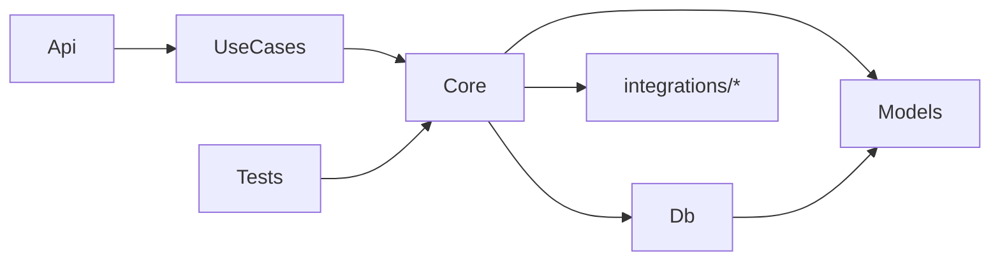

# Dipendenze tra progetti

**Models** non dipende da nessuno. Raccoglie i tipi condivisi: DTO, enum di dominio, `Result<T>`. È la base trasversale referenziata da Db (per gli enum nelle entità) e Core (per DTO ed enum). Vedi [Models](07-models.md).

**Db** contiene DbContext (Unit of Work), le entità di dominio, i DbSet, la Fluent API e le migration. Entity Framework è la libreria di accesso ai dati: non esiste un repository pattern e Core usa direttamente il DbContext.

**Core** dipende da Db, Models e dai progetti di integrazione. Contiene domain service, validator e DI extension per dominio. Usa le librerie pesanti (EF, MailKit, html2pdf…) attraverso le interfacce esposte dagli altri progetti, che restano confinate dentro di essi.

**Progetti di integrazione** (`integrations/*`) espongono interfacce ad-hoc che wrappano librerie esterne o client verso sistemi terzi. Core usa le interfacce; le librerie restano confinate nel progetto. Vedi [Progetti di integrazione](06-integrazioni.md).

**UseCases** è il livello intermedio tra Core e i progetti di alto livello. Contiene i comandi completi che chiudono la unit of work (`SaveChanges`) e restituiscono un `Result`. Dipende solo da Core. Vivendo spesso come sottocartella di Core, può essere estratto in un progetto first-class quando cresce. Vedi [UseCases](04-usecases.md).

**Api** (e Console, Worker) dipende da UseCases. Chiama i comandi pronti e gestisce input/output HTTP: non orchestra Core direttamente né chiude transazioni. È il composition root: registra via DI le implementazioni concrete di Db e integrazioni.

**Tests** dipende da Core e ottiene tutto il resto transitivamente: UseCases (come sottocartella di Core), Db, Models e i progetti di integrazione. Testa la logica di dominio e i comandi completi. Le integrazioni si sostituiscono con double in-memory via DI: non occorre istanziare le implementazioni reali.

Se un progetto di alto livello (Api, Console) contiene business logic o chiama `SaveChanges`, quella logica è nel posto sbagliato.
