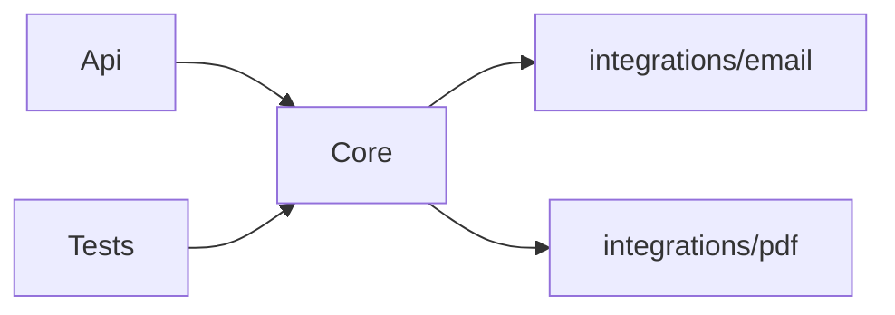

# Progetti di integrazione

## Perché isolare le integrazioni

Alcuni componenti interagiscono con l'esterno: client HTTP verso API di terze parti, client SOAP, generatori di PDF, integrazioni con il sistema operativo. Queste implementazioni portano con sé dipendenze pesanti che non devono contaminare Core.

Isolare ogni integrazione in un progetto dedicato ha due effetti:

- **Testabilità**: Core dipende solo da interfacce. Nei test si sostituisce l'implementazione reale con un double senza toccare la logica di dominio.
- **Confinamento**: le librerie esterne restano dentro il progetto di integrazione. Nessun altro progetto le vede o le aggrega.

## Struttura

Le integrazioni vivono in `integrations/`, alla radice del repository:

```
NomeSoluzione/
├── src/
├── integrations/
│   ├── email/
│   │   └── email.csproj             # NomeSoluzione.Email
│   ├── pdf/
│   │   └── pdf.csproj               # NomeSoluzione.Pdf
│   └── payments/
│       └── payments.csproj          # NomeSoluzione.Payments
└── tests/
```

Ogni progetto segue le stesse [convenzioni di naming](01-struttura-fisica.md#naming): cartella semplice, `AssemblyName` e `RootNamespace` impostati esplicitamente nel `.csproj`.

## Pattern: interfaccia e implementazione nell'integrazione, uso in Core

Il progetto di integrazione espone l'interfaccia e la sua implementazione concreta:

```csharp
// integrations/email — IEmailSender e SmtpEmailSender vivono qui
public interface IEmailSender
{
    Task SendAsync(Email email, CancellationToken ct = default);
}

public class SmtpEmailSender : IEmailSender
{
    public async Task SendAsync(Email email, CancellationToken ct = default)
    {
        // implementazione con MailKit — MailKit non esce da questo progetto
    }
}
```

Core dipende dal progetto di integrazione e usa l'interfaccia:

```csharp
// Core dipende su integrations/email e usa IEmailSender
public class InviaConfermaOrdine
{
    private readonly IEmailSender _emailSender;
    // ...
}
```

`Api` è il composition root e registra l'implementazione concreta:

```csharp
builder.Services.AddScoped<IEmailSender, SmtpEmailSender>();
```

Nei test si registra un'implementazione controllata — MailKit non viene mai istanziato:

```csharp
services.AddScoped<IEmailSender, FakeEmailSender>();
```

## Dipendenze

Core dipende dai progetti di integrazione, non il contrario:



Core usa le interfacce esposte dalle integrazioni. Non tocca mai MailKit, html2pdf o le altre librerie — quelle rimangono confinate nei rispettivi progetti.

❌ Da evitare: aggiungere la libreria di integrazione direttamente a `Core` o `Api`. Se `MailKit` compare nel `.csproj` di Core, il confinamento è compromesso e la libreria si propaga a tutti i progetti che dipendono da Core.
