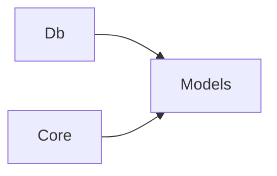

# Models

## Cosa contiene

Il progetto Models raccoglie i tipi condivisi tra più progetti della solution:

- **DTO** — request, response, command, query — i tipi che Core, UseCases e Api si scambiano.
- **Enum di dominio** — `OrdineStato`, `ClienteTipo`, `MetodoPagamento`. Sono elenchi di costanti, non comportamento, e vivono fuori dalle entità.
- **Result\<T\>** — pattern di ritorno strutturato per successo/errore, prodotto da UseCases e consumato da Api.

Models contiene tipi, non comportamento. Niente logica di business, niente validazione, niente factory di dominio. I DTO si scrivono come `record` per immutabilità (vedi [Convenzioni](05-convenzioni.md)).

## Cosa NON contiene

- **Entità di dominio** (`Ordine`, `Cliente`) — vivono in Db con il DbContext
- **Domain service** (`GestoreScorte`) — vivono in Core
- **Validator** — vivono in Core, accanto al dominio che validano
- **Use case** — vivono in UseCases

## Struttura

Organizzata per dominio, come Core:

```
src/models/
├── models.csproj                    # NomeSoluzione.Models
├── Ordini/
│   ├── CreaOrdineDto.cs
│   ├── OrdineDettaglioDto.cs
│   └── OrdineStato.cs
├── Clienti/
│   ├── RegistraClienteDto.cs
│   └── ClienteDettaglioDto.cs
└── Shared/
    └── Result.cs
```

## Dipendenze

Models non dipende da nessun altro progetto. È la base trasversale referenziata da Db (per gli enum nelle entità) e Core (per DTO ed enum nei domain service e validator). Api e UseCases ne ottengono i tipi transitivamente.



❌ Da evitare: aggiungere logica in Models (metodi di business, costruttori con validazione, factory di dominio). Se un DTO richiede logica di costruzione, quella logica vive nel domain service o nel validator. Models resta una raccolta di tipi puri.
