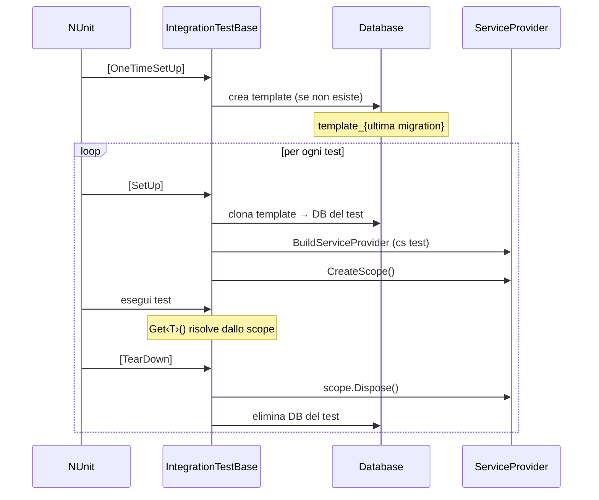
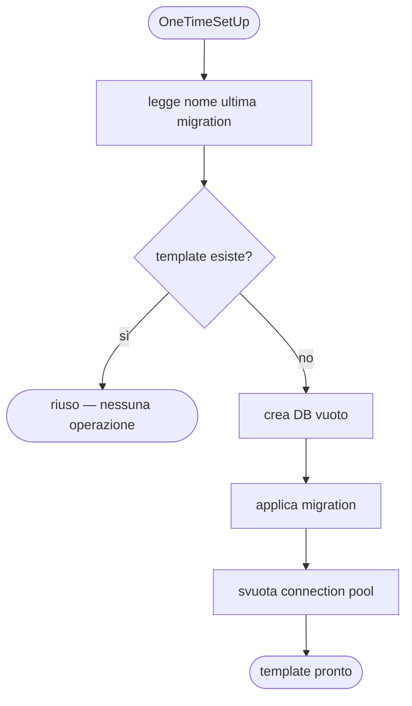
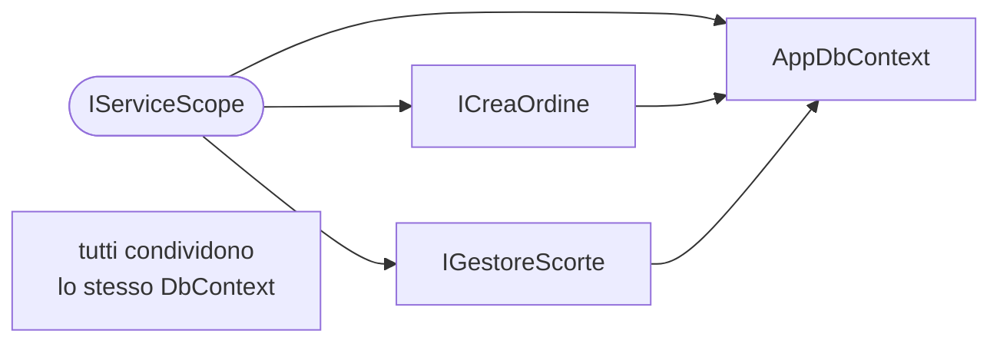

import Tabs from '@theme/Tabs';
import TabItem from '@theme/TabItem';

# Pattern: template e scope

## Perché test di integrazione

I test unitari verificano la logica isolata; i test di integrazione verificano che la logica funzioni con il database reale. Sono quelli che trovano i problemi che contano: query N+1, constraint violati, migration incomplete, comportamenti LINQ non traducibili in SQL.

SQLite in-memory è più veloce ma non si comporta come un database reale su tipi, constraint, case sensitivity e funzioni specifiche del motore. Il database dei test deve essere lo stesso motore di produzione.

---

## Il ciclo di vita

Ogni test riceve un database dedicato clonato da un template e uno scope DI fresco. Il template viene creato una volta sola per sessione e riusato per tutti i test e tutte le fixture.



Il clone è un'operazione istantanea o quasi: copia struttura e dati del template senza toccare i file di produzione.

---

## Invalidazione del template

Il template è nominato con il nome dell'ultima migration. Se le migration cambiano, il nome cambia, il vecchio template non viene trovato e ne viene creato uno nuovo automaticamente.



I template obsoleti (da migration precedenti) non vengono rimossi automaticamente: si eliminano manualmente o con uno script di pulizia occasionale.

---

## Scope DI per ogni test

Ogni test ha il proprio `IServiceScope`. I servizi si risolvono dallo scope con `Get<T>()` — nessun `new` manuale. `Db` e tutti i servizi dello stesso scope condividono il `DbContext`, come avviene in produzione durante una richiesta HTTP.



Il `ServiceProvider` viene costruito con la connection string del DB di test e smaltito al `[TearDown]`, insieme allo scope.

---

## Implementazione della classe base

La logica di creazione, clone ed eliminazione del database dipende dal motore. La classe base espone `MasterConnectionString` come proprietà virtuale per permettere alle sottoclassi di sostituire la fonte (es. Testcontainers — vedi [03-testcontainers](03-testcontainers.md)).

<Tabs groupId="db-engine">
<TabItem value="postgres" label="PostgreSQL" default>

```csharp
using Microsoft.EntityFrameworkCore;
using Microsoft.Extensions.DependencyInjection;
using NUnit.Framework;
using Npgsql;

[TestFixture]
public abstract class IntegrationTestBase
{
    private static string? _templateDbName;
    private string _testDbName = null!;
    private ServiceProvider _provider = null!;
    private IServiceScope _scope = null!;

    protected T Get<T>() where T : notnull
        => _scope.ServiceProvider.GetRequiredService<T>();

    protected AppDbContext Db => Get<AppDbContext>();

    protected virtual Task SeedAsync(AppDbContext db) => Task.CompletedTask;

    protected virtual string MasterConnectionString =>
        Environment.GetEnvironmentVariable("TEST_DB_CONNECTION")
        ?? "Host=localhost;Username=postgres;Password=secret";

    [OneTimeSetUp]
    public async Task PrepareTemplate()
    {
        if (_templateDbName is not null) return;

        var opts = new DbContextOptionsBuilder<AppDbContext>()
            .UseNpgsql($"{MasterConnectionString};Database=postgres").Options;
        await using var ctx = new AppDbContext(opts);
        var lastMigration = ctx.Database.GetMigrations().Last();
        _templateDbName = $"testdb_template_{lastMigration.ToLowerInvariant()}";

        await using var conn = new NpgsqlConnection($"{MasterConnectionString};Database=postgres");
        await conn.OpenAsync();

        await using var check = conn.CreateCommand();
        check.CommandText = "SELECT 1 FROM pg_database WHERE datname = $1";
        check.Parameters.AddWithValue(_templateDbName);
        if (await check.ExecuteScalarAsync() is not null) return;

        await using var create = conn.CreateCommand();
        create.CommandText = $"CREATE DATABASE \"{_templateDbName}\"";
        await create.ExecuteNonQueryAsync();

        var templateOpts = new DbContextOptionsBuilder<AppDbContext>()
            .UseNpgsql($"{MasterConnectionString};Database={_templateDbName}").Options;
        await using var templateCtx = new AppDbContext(templateOpts);
        await templateCtx.Database.MigrateAsync();

        await NpgsqlConnection.ClearAllPoolsAsync();
    }

    [SetUp]
    public async Task CreateTestScope()
    {
        _testDbName = $"testdb_{Guid.NewGuid():N}";

        await using var conn = new NpgsqlConnection($"{MasterConnectionString};Database=postgres");
        await conn.OpenAsync();
        await using var cmd = conn.CreateCommand();
        // Clone istantaneo del template
        cmd.CommandText = $"CREATE DATABASE \"{_testDbName}\" TEMPLATE \"{_templateDbName}\"";
        await cmd.ExecuteNonQueryAsync();

        var services = new ServiceCollection();
        ConfigureServices(services, $"{MasterConnectionString};Database={_testDbName}");
        _provider = services.BuildServiceProvider(validateScopes: true);
        _scope = _provider.CreateScope();

        await SeedAsync(Db);
    }

    [TearDown]
    public async Task DropTestScope()
    {
        _scope.Dispose();
        await _provider.DisposeAsync();
        await NpgsqlConnection.ClearAllPoolsAsync();

        await using var conn = new NpgsqlConnection($"{MasterConnectionString};Database=postgres");
        await conn.OpenAsync();
        await using var cmd = conn.CreateCommand();
        // WITH (FORCE) termina le connessioni attive (PostgreSQL 13+)
        cmd.CommandText = $"DROP DATABASE IF EXISTS \"{_testDbName}\" WITH (FORCE)";
        await cmd.ExecuteNonQueryAsync();
    }

    private static void ConfigureServices(IServiceCollection services, string connectionString)
    {
        services.AddDbContext<AppDbContext>(opt => opt.UseNpgsql(connectionString));
        services.AddScoped<ICreaOrdine, CreaOrdine>();
        services.AddScoped<IGestoreScorte, GestoreScorte>();
        // ... stesse registrazioni di Program.cs
    }
}
```

</TabItem>
<TabItem value="sqlserver" label="SQL Server">

SQL Server non ha un meccanismo di clone istantaneo. Il template viene salvato come file `.bak`; ogni test ripristina il backup in un nuovo database.

```csharp
using Microsoft.EntityFrameworkCore;
using Microsoft.Extensions.DependencyInjection;
using Microsoft.Data.SqlClient;
using NUnit.Framework;

[TestFixture]
public abstract class IntegrationTestBase
{
    private static string? _templateDbName;
    private static string? _backupPath;
    private string _testDbName = null!;
    private ServiceProvider _provider = null!;
    private IServiceScope _scope = null!;

    protected T Get<T>() where T : notnull
        => _scope.ServiceProvider.GetRequiredService<T>();

    protected AppDbContext Db => Get<AppDbContext>();

    protected virtual Task SeedAsync(AppDbContext db) => Task.CompletedTask;

    protected virtual string MasterConnectionString =>
        Environment.GetEnvironmentVariable("TEST_DB_CONNECTION")
        ?? "Server=localhost;User Id=sa;Password=Secret123!;TrustServerCertificate=True";

    [OneTimeSetUp]
    public async Task PrepareTemplate()
    {
        if (_templateDbName is not null) return;

        var opts = new DbContextOptionsBuilder<AppDbContext>()
            .UseSqlServer(MasterConnectionString).Options;
        await using var ctx = new AppDbContext(opts);
        var lastMigration = ctx.Database.GetMigrations().Last();
        _templateDbName = $"testdb_template_{lastMigration.ToLowerInvariant()}";
        _backupPath = Path.Combine(Path.GetTempPath(), $"{_templateDbName}.bak");

        if (File.Exists(_backupPath)) return;

        // Crea il DB template e applica le migration
        var templateCs = $"{MasterConnectionString};Initial Catalog={_templateDbName}";
        var templateOpts = new DbContextOptionsBuilder<AppDbContext>()
            .UseSqlServer(templateCs).Options;
        await using var templateCtx = new AppDbContext(templateOpts);
        await templateCtx.Database.MigrateAsync();

        // Salva il backup
        await using var conn = new SqlConnection(templateCs);
        await conn.OpenAsync();
        await using var cmd = conn.CreateCommand();
        cmd.CommandText = $"BACKUP DATABASE [{_templateDbName}] TO DISK = N'{_backupPath}' WITH INIT";
        cmd.CommandTimeout = 120;
        await cmd.ExecuteNonQueryAsync();
    }

    [SetUp]
    public async Task CreateTestScope()
    {
        _testDbName = $"testdb_{Guid.NewGuid():N}";
        var testCs = $"{MasterConnectionString};Initial Catalog={_testDbName}";

        // Ripristina il backup come nuovo database
        await using var conn = new SqlConnection($"{MasterConnectionString};Initial Catalog=master");
        await conn.OpenAsync();
        await using var cmd = conn.CreateCommand();
        cmd.CommandTimeout = 120;
        cmd.CommandText = $"""
            RESTORE DATABASE [{_testDbName}]
            FROM DISK = N'{_backupPath}'
            WITH
                MOVE '{_templateDbName}' TO '{Path.GetTempPath()}{_testDbName}.mdf',
                MOVE '{_templateDbName}_log' TO '{Path.GetTempPath()}{_testDbName}.ldf',
                REPLACE, RECOVERY
            """;
        await cmd.ExecuteNonQueryAsync();

        var services = new ServiceCollection();
        ConfigureServices(services, testCs);
        _provider = services.BuildServiceProvider(validateScopes: true);
        _scope = _provider.CreateScope();

        await SeedAsync(Db);
    }

    [TearDown]
    public async Task DropTestScope()
    {
        _scope.Dispose();
        await _provider.DisposeAsync();

        await using var conn = new SqlConnection($"{MasterConnectionString};Initial Catalog=master");
        await conn.OpenAsync();
        await using var cmd = conn.CreateCommand();
        cmd.CommandText = $"""
            ALTER DATABASE [{_testDbName}] SET SINGLE_USER WITH ROLLBACK IMMEDIATE;
            DROP DATABASE [{_testDbName}];
            """;
        await cmd.ExecuteNonQueryAsync();
    }

    private static void ConfigureServices(IServiceCollection services, string connectionString)
    {
        services.AddDbContext<AppDbContext>(opt => opt.UseSqlServer(connectionString));
        services.AddScoped<ICreaOrdine, CreaOrdine>();
        services.AddScoped<IGestoreScorte, GestoreScorte>();
        // ... stesse registrazioni di Program.cs
    }
}
```

</TabItem>
<TabItem value="sqlite" label="SQLite">

SQLite non ha un server: il template è un file `.db`. Il clone è una semplice copia di file — operazione istantanea su qualsiasi OS.

Utile per test rapidi in ambienti senza Docker o SQL Server. Non sostituisce i test su PostgreSQL o SQL Server per funzionalità specifiche del motore (tipi, funzioni window, full-text search).

```csharp
using Microsoft.EntityFrameworkCore;
using Microsoft.Extensions.DependencyInjection;
using NUnit.Framework;

[TestFixture]
public abstract class IntegrationTestBase
{
    private static string? _templatePath;
    private string _testDbPath = null!;
    private ServiceProvider _provider = null!;
    private IServiceScope _scope = null!;

    protected T Get<T>() where T : notnull
        => _scope.ServiceProvider.GetRequiredService<T>();

    protected AppDbContext Db => Get<AppDbContext>();

    protected virtual Task SeedAsync(AppDbContext db) => Task.CompletedTask;

    [OneTimeSetUp]
    public async Task PrepareTemplate()
    {
        if (_templatePath is not null) return;

        var opts = new DbContextOptionsBuilder<AppDbContext>()
            .UseNpgsql("Host=localhost;Database=dummy").Options;
        await using var ctx = new AppDbContext(opts);
        var lastMigration = ctx.Database.GetMigrations().Last();

        _templatePath = Path.Combine(
            Path.GetTempPath(),
            $"testdb_template_{lastMigration.ToLowerInvariant()}.db");

        if (File.Exists(_templatePath)) return;

        // Crea il template applicando le migration
        var templateOpts = new DbContextOptionsBuilder<AppDbContext>()
            .UseSqlite($"Data Source={_templatePath}").Options;
        await using var templateCtx = new AppDbContext(templateOpts);
        await templateCtx.Database.MigrateAsync();
    }

    [SetUp]
    public async Task CreateTestScope()
    {
        _testDbPath = Path.Combine(Path.GetTempPath(), $"testdb_{Guid.NewGuid():N}.db");

        // Clone istantaneo: copia del file
        File.Copy(_templatePath!, _testDbPath);

        var services = new ServiceCollection();
        ConfigureServices(services, $"Data Source={_testDbPath}");
        _provider = services.BuildServiceProvider(validateScopes: true);
        _scope = _provider.CreateScope();

        await SeedAsync(Db);
    }

    [TearDown]
    public async Task DropTestScope()
    {
        _scope.Dispose();
        await _provider.DisposeAsync();

        // EF tiene la connessione aperta — bisogna chiuderla prima di eliminare il file
        SqliteConnection.ClearAllPools();
        File.Delete(_testDbPath);
    }

    private static void ConfigureServices(IServiceCollection services, string connectionString)
    {
        services.AddDbContext<AppDbContext>(opt => opt.UseSqlite(connectionString));
        services.AddScoped<ICreaOrdine, CreaOrdine>();
        services.AddScoped<IGestoreScorte, GestoreScorte>();
        // ... stesse registrazioni di Program.cs
    }
}
```

</TabItem>
</Tabs>
